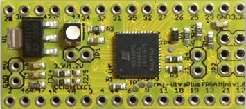
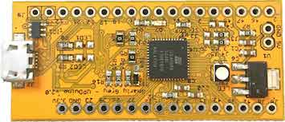

# iCE40UP5K support 




This board directory builds for the iCE40UP5K in the QFN48 (SG48) package.  iCE40UP5K SG48 is the part used on the [Gnarly Grey UPDuino Mini board](http://gnarlygrey.atspace.cc/development-platform.html). 
 
## Peripheral support

So far only UART is tested and supported.  Three bits of the PC monitor bus are mapped to the dedicated LED drivers to give some indication of the currently running code.

VGA is brought out to pins but have not been tested.

PS/2, button, and TM1638 front panel are not supported.

At this time, all ROM and RAM are mapped as block RAM, and arachne-pnr reports that 28/30 BRAMs are utilized.  If larger ROMs or more RAM is needed, RAM should be moved to SPRAM instead.

The on-chip oscillator and PLL are used to generate the 25MHz clock used by the design.

See the .pcf for pin connections.  Note that the iCE40UP5K pin numbers in the .pcf correspond to the UPDuino pin silkscreen labels.

## Building

Install a recent IceStorm toolchain, and:

```
$ cd yosys
$ make
```

## Use

Flash using your method of choice.  Attach a 3.3V serial connection to uart_tx (output to PC) and uart_rx (input from PC).  Start a terminal at 115200,n,8,1.

Toggling CRESET_B restarts to the Woz monitor.

The Woz monitor is a simple hex debugger.  To run BASIC, type: "E000R".  Note that both BASIC and the monitor require commands to be input as caps.
