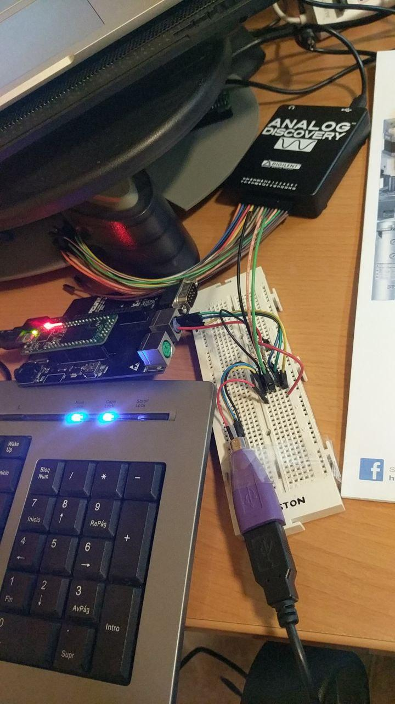

# Terminal for testing USB - Atlas CYC1000 port 

CYC1000 Quartus project for "Terminal for testing USB" by Somhic (16/07/21) adapted from original code from Antonio Sánchez (@TheSonders) (https://github.com/TheSonders/USBKeyboard)

**Features:**

* USB keyboard input without any additional hardware decoder
* HDMI video output 

**Hardware required**:

I used the following setup:

- CYC1000 Fpga 
- [Atlas board](https://github.com/AtlasFPGA) for a protected ps2 keyboard circuit
- USB keyboard (low speed)
- PS2 to USB adapter
- 2 pull-down resistors of 4700 Ohm

See schematics folder.

**Compiling:**

* Load project  VideoText.qpf
* sof/svf files already included in output_files/

### STATUS

* Just working on low speed USB keyboards (more manufacturers/models testing is required)

* HDMI video outputs special resolution, so does not work in all monitors.

