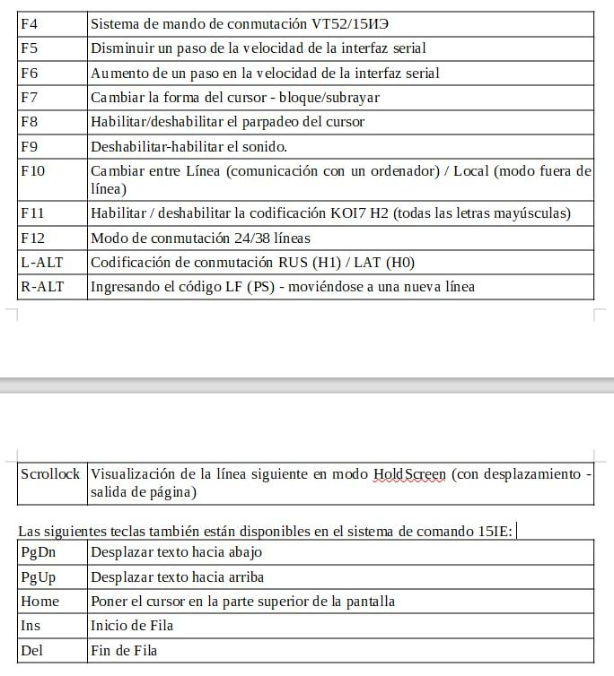

Versión para Atlas (cyc1000) 

---------------
Versión FPGA del terminal VT52 y 15IE00-013

Este proyecto es una terminal de hardware completa que opera en el sistema de comando VT52
y 15IE-00-013 (terminal Fryazino). La salida se produce en cualquier monitor VGA (se utiliza la resolución 640*480).

Se utiliza un teclado PS/2 normal para la entrada.

El terminal puede funcionar en codificación KOI7 H0/H1 (letras grandes-pequeñas rusas y latinas), así como en codificación KOI7 H2 (solo
grandes letras rusas y latinas): los terminales CM7209 y VTA-2000-3 funcionaron en este modo.
El cambio de codificación se realiza desde el teclado con la tecla F11.

El terminal se puede utilizar tanto como dispositivo independiente como integrado en otros proyectos como módulo.

El proyecto ocupa un poco más de 2000 celdas lógicas y 21 KB de memoria interna de la FPGA de la serie Altera Cyclone 4,
y encaja fácilmente incluso en el más joven de los microcircuitos de esta línea: EP4CE6. Para construir una terminal completa, es suficiente
cualquiera, la placa de depuración más simple en cualquier Altera Cyclone 4, y para ella: un conector VGA, un conector PS2 y, si lo desea, un convertidor
Señales UART TTL a algún bus serie estándar (por ejemplo, RS232 o bucle de corriente de 20 mA). O, más fácil, use una tarifa,
en el que todo esto ya está instalado, entonces no tendrá que soldar nada en absoluto.

Toda la documentación detallada del proyecto se encuentra en el archivo DOC/terminal.pdf. ¡Definitivamente recomiendo echarle un vistazo! 

Teclas del core:

--------------------------------

FPGA-версия терминала VT52 и 15ИЭ00-013

Данный проект представляет собой законченный аппартный терминал, работающий в системе команд VT52
и 15ИЭ-00-013 (фрязинский терминал). Вывод производится на любой VGA-монитор (используется разрешение 640*480),
для ввода используется обычная PS/2-клавиатура.

Терминал может работать в кодировке КОИ7 Н0/Н1 (большие-малые русские и латинские буквы), а также в кодировке КОИ7 Н2 (только 
большие русские и латинские буквы) - в таком режиме работали терминалы СМ7209 и ВТА-2000-3. 
Переключение кодировок производится с клавиатуры клавишей F11.

Терминал может быть использован и как самостоятельное устройство, и встраиваться в другие проекты в виде моудля.

Проект занимает чуть больше 2000 логических ячеек и 21 Кбайт внутренней памяти FPGA серии Altera Cyclone 4, 
и спокойно влезает даже в самую младшую из микросхем этой линейки - EP4CE6. Для построения полноценного терминала достаточно
любой, самой простой отладочной платы на любой Altera Cyclone 4, а к ней - разъем VGA, разъем PS2 и, по желанию, преобразователь
сигналов UART TTL в какую-нибудь стандартную последовательную шину (например RS232 или 20ма токовая петля). Или, что проще, использовать плату,
на которой все это уже установлено - тогда паять вообще ничего не придется.

Вся подробная документация по проекту лежит в файле DOC/terminal.pdf. Советую обязательно ознакомиться!
